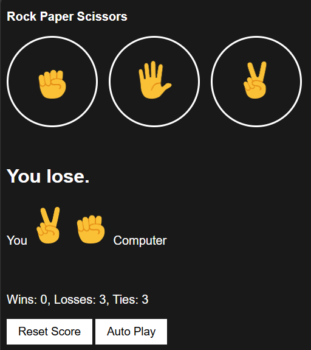

# Rock-Paper-Scissors---Final-Version 

The **final Rock Paper Scissors** brings all features together into a polished, interactive game.  
You can **play manually** (clicking icons), use **keyboard shortcuts** (`r`, `p`, `s`), or enable **Autoplay mode**, where the computer plays automatically every second.  
Scores are **tracked with localStorage**, persist after refresh, and can be **reset anytime**, making this the most complete version of the project.  

---

## ✨ Features  
- 🎮 **Play Options** – Click buttons or use keyboard shortcuts (`r`, `p`, `s`).  
- 🤖 **Autoplay Mode** – Computer plays automatically until stopped.  
- 📊 **Persistent Score** – Wins, losses, and ties saved using localStorage.  
- 🔄 **Reset Button** – Clear score history anytime.  
- 🎨 **Clean UI** – Simple, emoji-based design.  

---

## 📸 Screenshot Preview  
  

---

## 🚀 Demo  
👉 [Play Now](https://harikareddi13.github.io/Rock-Paper-Scissors---Final-Version/)  

---

## 🛠️ Tools & Technologies Used  
- **HTML5** → Game structure and layout.  
- **CSS3** → Styling, layout, and clean design.  
- **JavaScript (Vanilla JS)** →  
  - Game logic (winner/loser/tie).  
  - DOM updates with `querySelector` & `innerHTML`.  
  - Keyboard event handling (`keydown`).  
  - Autoplay with `setInterval` & `clearInterval`.  
  - Persistent score using **localStorage**.  

---

## 📚 What I Learned  
- 🎮 Handling **multiple input methods** (clicks + keyboard).  
- ⚡ Using **timers** (`setInterval`, `clearInterval`) for autoplay.  
- 📊 Working with **localStorage** for persistence.  
- 🎨 Updating the **DOM dynamically** with JavaScript.  
- 💻 Organizing a project with **HTML, CSS, JS files**.  
- 🚀 Deploying projects with **GitHub Pages**.  

---

## ⚡ How to Access / Run  
### 🔗 Online  
🎮 Play it directly here: [Rock Paper Scissors Arena – Final](https://harikareddi13.github.io/Rock-Paper-Scissors---Final-Version/)  

### 💻 Run Locally  
1. Clone this repository:  
   ```bash
   git clone https://github.com/harikareddi13/Rock-Paper-Scissors---Final-Version.git
